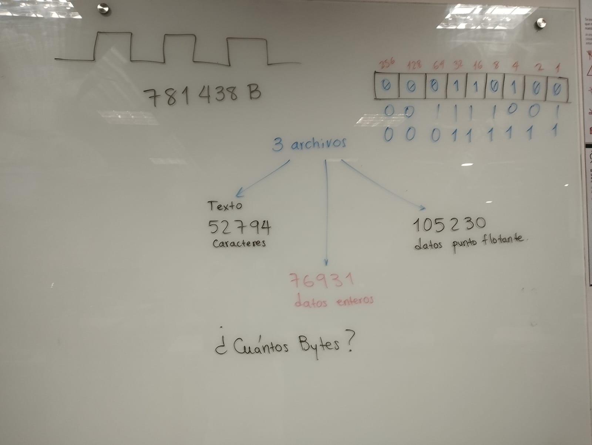

### Ejercicios

1. **¿Qué número binario representa el carácter 'C' en ASCII?**

   El carácter `'C'` en ASCII tiene el valor decimal **67**.  
   En binario, esto se representa como: 67 (decimal) = 01000011 (binario).


Por lo tanto, el número binario que representa `'C'` es: **01000011**.

2. **Convierte el número flotante 5.75 a binario (explica los pasos).**

Para convertir **5.75** a binario, se divide en dos partes:

- Parte entera: `5`
- Parte fraccionaria: `0.75`

**Paso 1: Convertir la parte entera (5)**  
```
5 ÷ 2 = 2, residuo 1
2 ÷ 2 = 1, residuo 0
1 ÷ 2 = 0, residuo 1
→ 5 = 101 (binario)
```

**Paso 2: Convertir la parte fraccionaria (0.75)**  
```
0.75 × 2 = 1.5 → parte entera = 1
0.5 × 2 = 1.0 → parte entera = 1
→ 0.75 = 0.11 (binario)
```

**Resultado final:**  
5.75 = 101.11 (binario)

Entonces, **5.75 en binario es: `101.11`**



### Ejercicios

1. **¿Cuántos bytes se necesitan para almacenar la palabra “Hola” en ASCII?**

   En ASCII, **cada carácter ocupa 1 byte**.

   La palabra `"Hola"` tiene 4 caracteres: H - o - l - a → 4 caracteres × 1 byte = 4 bytes

   Por lo tanto, se necesitan **4 bytes** para almacenar `"Hola"` en ASCII.

2. **¿Cuántos bits hay en 5 KB?**

Sabemos que:

- 1 kilobyte (KB) = 1024 bytes
- 1 byte = 8 bits

Entonces:
```
5 KB = 5 × 1024 bytes = 5120 bytes
5120 bytes × 8 bits = 40,960 bits
```
Por lo tanto, **5 KB = 40,960 bits**

## 4. Ejercicios Finales de Repaso

1. **Explica, en tus propias palabras, por qué es necesario que las computadoras representen los datos en binario.**

   Las computadoras están construidas con circuitos electrónicos que solo pueden detectar dos estados: **encendido (1)** y **apagado (0)**.  
   Por eso, todos los datos,textos, imágenes, sonidos y programas se convierten en **secuencias de ceros y unos**, es decir, en binario.  
   Esto permite que los procesadores interpreten y manipulen la información de forma precisa y confiable.

---

2. **Convierte el número binario 10011011 a decimal y a hexadecimal.**

   - **Binario a decimal:**

     ```
     1×2⁷ + 0×2⁶ + 0×2⁵ + 1×2⁴ + 1×2³ + 0×2² + 1×2¹ + 1×2⁰
     = 128 + 0 + 0 + 16 + 8 + 0 + 2 + 1 = 155
     ```

    Resultado decimal: **155**

   - **Binario a hexadecimal:**

     Agrupamos en bloques de 4 bits:  
     `1001 1011` →  
     `1001` = 9  
     `1011` = B

    Resultado hexadecimal: **0x9B**

---

3. **Investiga y describe cómo se representa una imagen en formato PNG en el disco.**

   Un archivo **PNG (Portable Network Graphics)** almacena imágenes en un formato comprimido sin pérdida.  
   En disco, se representa como una **secuencia de bytes estructurados** en **"chunks" (bloques)**, que incluyen:

   - **Cabecera** (`IHDR`): contiene ancho, alto, profundidad de color, tipo de color, etc.
   - **Datos de imagen** (`IDAT`): contiene los píxeles comprimidos usando el algoritmo **DEFLATE**.
   - **Final del archivo** (`IEND`): indica el fin del archivo PNG.

   Además, puede incluir bloques opcionales para transparencia (`tRNS`), corrección de color (`gAMA`), metadatos (`tEXt`), etc.

---

4. **Analiza la siguiente situación: ¿Qué sucede si intentas almacenar un número mayor al que puede representar un byte (por ejemplo, 300)? ¿Cómo lo maneja Python?**

   Un **byte** puede representar valores entre **0 y 255** (8 bits).  
   Si se intenta almacenar un número mayor, como **300**, en un solo byte, se produce un **desbordamiento** y se pierden datos.

   En **Python**, sin embargo, los enteros (`int`) no tienen un tamaño fijo.  
   Python permite trabajar con números **tan grandes como la memoria lo permita**, gracias a su sistema de enteros de precisión arbitraria.

   Ejemplo en Python:

   ```python
   x = 300
   print(x)  # Python lo maneja sin problema
   ````
   Pero si se intenta guardar 300 en una estructura que solo acepta bytes (como bytes()), entonces sí lanza un error:

   ```python
   bytes([300])  # Error: bytes must be in range(0, 256)
   ```

   Entonces, Python permite representar 300 como entero, pero no se puede almacenar en un solo byte.


