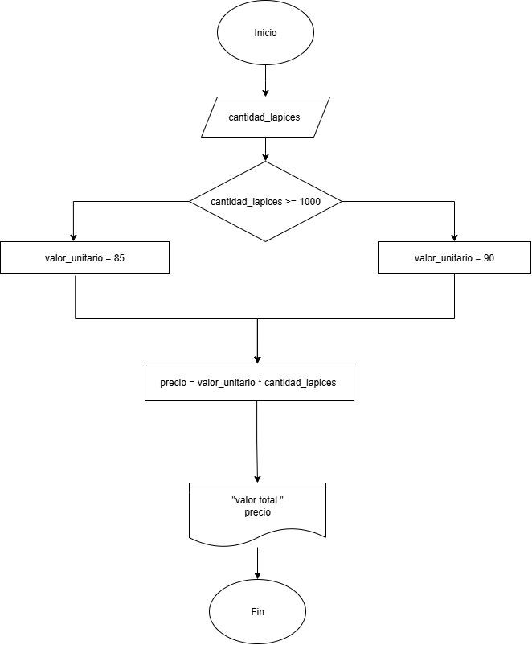
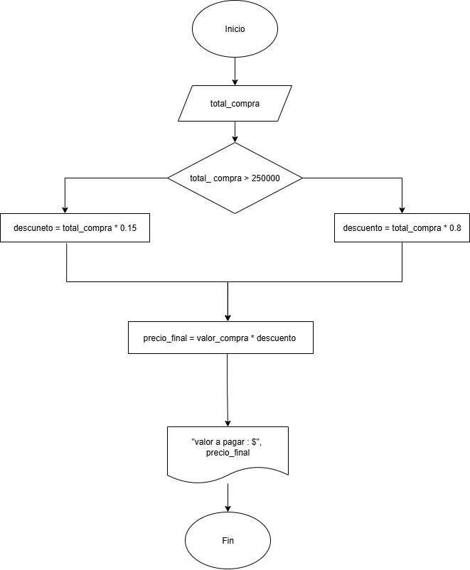
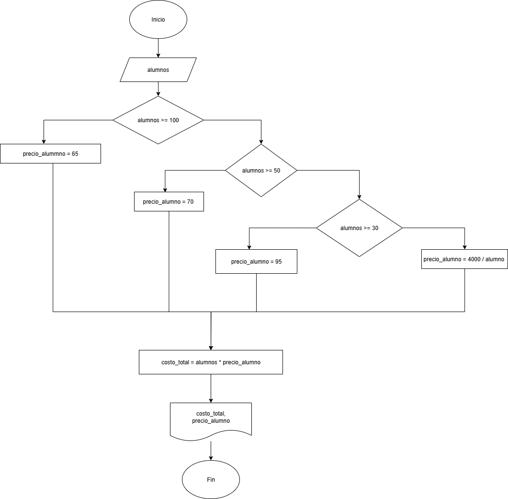

## Ejercicio 2

- Construye un algoritmo que, al recibir como datos **el ID** del empleado y los seis primeros sueldos del año, calcule el ingreso total semestral y el promedio mensual, e imprima el ID del empleado, el ingreso total y el promedio mensual.

## pseudocódigo 

```
Inicio
leer ID, S1, S2, S3, S4, S5, S6
total = S1 + S2 + S3 + S4 + S5 + S6
promedio = total / 6 
mostrar ID, total, promedio
Fin
```
## Diagrama de flujo


## ejercicio 3
pagina 43 
una empresa importadora desea detrminar cuántos dólares puede adquirir con equis cantidad de dinero colombiano. Realice un diagrama de flujo y Pseudocódigo que represente el algoritmo para tal fin.

## pseudocódigo

```
IniciO
X = cantidad_de_dinero_colombiano
D = preci-dolar_en_pesos_colombianos 
Leer x
total_dolar = X / D
mostrar total_dolar
Fin
```
## Diagrama de flujo


## Ejercicio 4

- Realice un algoritmo para determinar cuánto se debe pagar por equis cantidad de lápices considerando que si son 1000 o más el costo es de $85 cada uno; De lo contrario, el precio es de $90. Representelo con el pseudocódigo y el diagrama de flujo.

| Variables |   Tipo    | Comentario            |
|-----------|-----------|-----------------------|
|  Lápices  |  Entrada  |	Cantidad de lápices |  
|  Precio   |  Salida	| Precio total de los lápices | 
|  85, 90	| Constantes| 	no cambia           |

## Pseudocódigo

```
Inicio
Leer lapices
si lapices >= 1000:
       valor_unidad = 85
Si no
    valor_unidad = 90
Fin si
Precio = Lapices * valor_unidad
Escribir "El valor total es:", Precio
Fin
 ```

 ## Diagrama de flujo 



## Ejercicio 5
- Un almacén de ropa tiene una promoción: por compras superiores a $250 000 se les aplicará un descuento del 15%, de caso contrario, sólo se aplicará un 8% de descuento. Realice un algoritmo para determinar el precio final que debe pagar una persona por comprar en dicho almacén y de cuánto es el descuento que obtendrá. Representelo mediante el pseudocódigo y el diagrama de flujo.

## Pseudocódigo

```
Inicio
Leer total_compra
Si total_compra > 250000
    descuento = total_compra * 0.15
Si no
    descuento = total_compra * 0.8
Fin si
precio_final = total_compra - descuento
Escribir "valor a pagar", precio_final
Fin
```
## Diagrama de flujo 



## Ejercicio 6

- El Director de una escuela está organizando un viaje de estudios, y requiere determinar cuánto debe cobrar a cada alumno y cuánto debe pagar a la compañía de viajes por el servicio. La forma de cobro es la siguiente:

  ○ Si son 100 alumnos o más, el costo por alumno es de $65.  
  ○ Si son entre 50 y 99 alumnos, el costo por alumno es de $70.  
  ○ Si son entre 30 y 49 alumnos, el costo por alumno es de $95.  
  ○ Si son menos que 30, el costo es de $4000.

  ## Pseudocódigo

```
  Inicio
Leer alumnos
Si alumnos >=100
   precio_alumno = 65
Si no 
   Si alumnos >= 50
     precio_alumno = 70
   Si no
     Si alumnos >=30
     precio_alumno = 95
     Si no precio_alumno = 4000/alumnos
Fin Si
costo_total = alumnos*precio_alumno
Mostrar costo_total, precio_alumno
Fin
```
## Diagrama de flujo 

